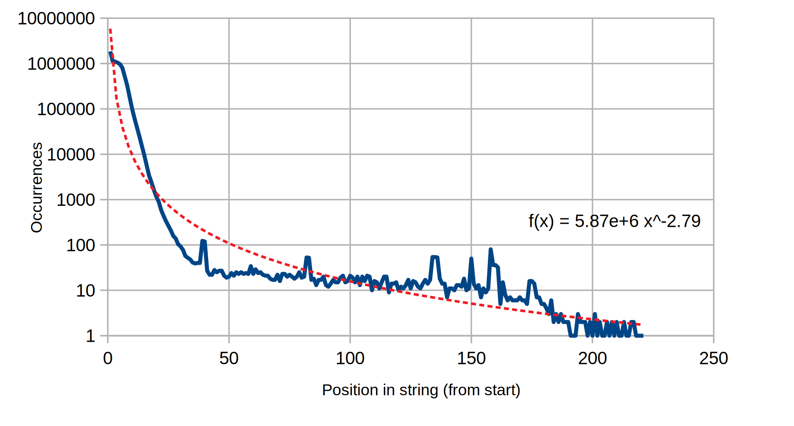

# Capitalizer
Capital letter (and symbol) heat-mapper and password capitalisation utility. This repo is a bit of a mix, and contains several projects.

## Capitalisation Utility
Very very simple little utility that will capitalise the first occurrence of any letter on each line of a given input file. This can be useful if, for example, you're using a password cracking algorithm that doesn't support capital letters such as [the original implementation of PCFGs for password cracking](https://sites.google.com/site/reusablesec/Home/password-cracking-tools/probablistic_cracker) by Matt Weir et al.

```
Usage: Capitalizer <input_file>
```

Output ends up on stdout, one line of input becomes one line of output. Input is of the format:

```
password
123456
Aaaaaa
letmein
123abc
```

Anything already capitalised (or anything that can't be capitalised) won't be touched. Here's the output for above:

```
Password
123456
Aaaaaa
Letmein
123Abc
```

## Mapping Utilities
Then we have two very similar utilities.

### Capitalizer.Mapper
A utility that will map the occurrences of capital letters against offset from the beginning (or end) of strings given in an input file (one per line).

```
Usage: Capitalizer.Mapper <input_file> [-r] [-s]
```

The two flags are both optional and do the following:

* `-r` maps offsets from the end of the string instead of the beginning.
* `-s` will strip all non-letter characters from strings before mapping capital letters.

### Capitalizer.SymbolMapper
A utility that will map the occurrences of symbols against offset from the beginning (or end) of strings given in an input file (one per line).

```
Usage: Capitalizer.SymbolMapper <input_file> [-r]
```

The flag is optional and does the following:

* `-r` maps offsets from the end of the string instead of the beginning.

These mapping utilities allow us to extract the data we need from large data sets for cool visualisations like the following (a graph of capital letter offsets from the start of every string in RockYou):


